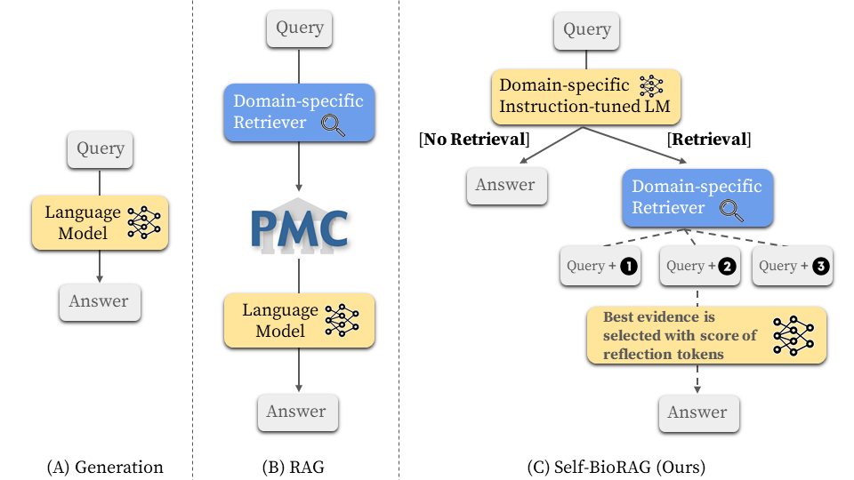
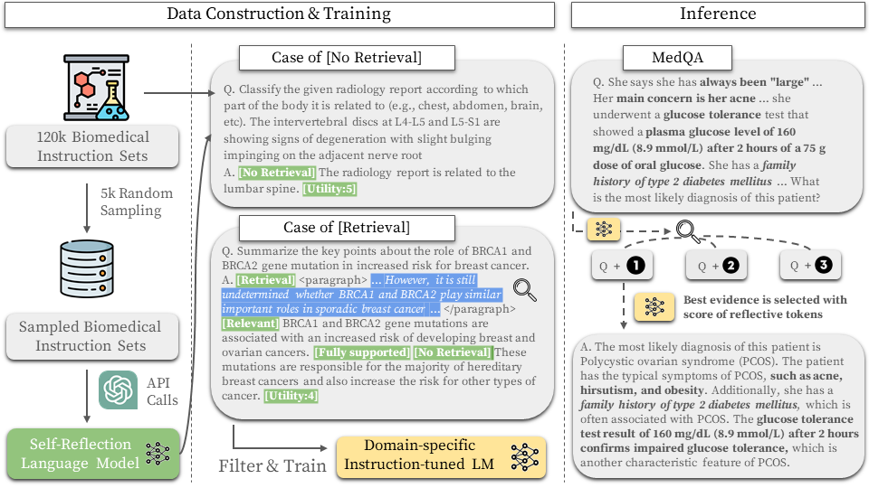

# Self-BioRAG: Improving Medical Reasoning through Retrieval and Self-Reflection with Retrieval-Augmented Large Language Models

This is a repository for [Improving Medical Reasoning through Retrieval and Self-Reflection with Retrieval-Augmented Large Language Models](https://arxiv.org/abs/2401.15269)
 by Minbyul Jeong, Jiwoong Sohn, Mujeen Sung, and Jaewoo Kang.

[7B Model](https://huggingface.co/dmis-lab/selfbiorag_7b) | [13B Model](https://huggingface.co/dmis-lab/selfbiorag_13b) | [Critic Model](https://huggingface.co/dmis-lab/selfbiorag_7b_critic) | [Training data](#datasets) | [Summary](#overall-workflow) | [Paper](https://arxiv.org/abs/2401.15269)

**Self-BioRAG** is a framework reliable for biomedical and clinical text instructions that specializes in self-reflection to retrieve, criticize, and generate explanations while preserving generation quality and reasoning ability.

The retrieval-augmented generation (RAG) framework performs document searches unconditionally, regardless of whether a query requires document retrieval. However, **Self-BioRAG** framework use domain-specific instruction-tuned language model to predict whether retrieval is necessary for given query. If the query doesn't require any retrieval of knowledge (factual contents), it directly predicts the answer. If the query necessitates retrieval knowledge, **Self-BioRAG** utilizes the domain-specific retriever (MedCPT, in our case) to retrieve relevant documents. After retrieving the top-k evidence, the language model selects the most pertinent evidence for the query. Ultimately, our language model is employed to select the best evidence and generate the answer based on the evidence and encoded knowledge.



## Updates
* \[**Apr 03, 2024**\] **Self-BioRAG** has been accepted in ISMB/ECCB'24.
* \[**Jan 30, 2024**\] **Self-BioRAG** has been released.

## Content
1. [Installation](#installation)
2. [Quick Usage](#quick-usage)
3. [Overall Workflow](#overall-workflow)
4. [Datasets](#datasets)
5. [Retriever](#retriever)
6. [Critic LM](#critic-lm)
7. [Generator LM](#generator-lm)
8. [Inference](#inference)
9. [FAQ](#faq)
10. [Citation](#citation)
11. [Contact Information](#contact-information)

## Installation
Please create a conda environment by running the command below.

```
conda env create -f selfbiorag.yaml
conda activate selfbiorag
```

If you try to install Python libraries through requirements by running the command below.
```
conda create -n selfbiorag python=3.10
conda activate selfbiorag
pip install -r requirements.txt
```

## Quick Usage
You can download Self-BioRAG from HuggingFace hub.
For inference, we recommend using [vllm](https://vllm.readthedocs.io/en/latest/) to speed up inference.
```py
from vllm import LLM, SamplingParams

model = LLM("dmis-lab/selfbiorag_7b", download_dir=your_download_path_to_load, dtype="half")
sampling_params = SamplingParams(temperature=0.0, top_p=1.0, max_tokens=100, skip_special_tokens=False)

query_1 = "Classify the given radiology report according to which part of the body it is related to (e.g., chest, abdomen, brain, etc). The intervertebral discs at L4-L5 and L5-S1 are showing signs of degeneration with slight bulging impinging on the adjacent nerve root"
query_2 = "Summarize the key points about the role of BRCA1 and BRCA2 gene mutation in increased risk for breast cancer."
queries = [query_1, query_2]

preds = model.generate([query for query in queries], sampling_params)
for pred in preds:
    print ("Model prediction: ", pred.outputs[0].text)
```
<!-- 
Output
```
Model prediction: 
Model prediction: 
``` -->


## Overall Workflow
Overview of our **Self-BioRAG** process:data construction, training, and inference of Critic LM and Generator LM.
We construct 120k bioemdical instruction sets using two off-the-shelf instruction sets [Mol-Instruction](https://github.com/zjunlp/Mol-Instructions) and [MedInstruct](https://github.com/XZhang97666/AlpaCare/tree/master) and one self-generated biomedical instruction set. We first sample 5k instructions to generate reflective tokens via GPT-4 API calls and then train the critic LM $C$ with these instructions. Using trained critic LM $C$, we filter out mispredicted reflective tokens, such as [Continue Generation]. We preserve 84k instruction sets annotated with pre-defined reflective tokens to train the generator LM $M$. Note that critic LM $C$ is only used for annotating reflective tokens used to filter instruction sets to train generator LM $M$. After training, the model $M$ can predict whether or not to use the retrieval method and combine the results of evidence and encoded knowledge to answer the question.



## Datasets
Download our overall data: [Instruction-Sets](http://nlp.dmis.korea.edu/projects/selfbiorag-jeong-et-al-2024/data/instruction.tar.gz), [Retriever](http://nlp.dmis.korea.edu/projects/selfbiorag-jeong-et-al-2024/data/retriever.tar.gz), [Critic-LM](http://nlp.dmis.korea.edu/projects/selfbiorag-jeong-et-al-2024/data/critic.tar.gz), [Generator-LM](http://nlp.dmis.korea.edu/projects/selfbiorag-jeong-et-al-2024/data/generator.tar.gz).
You will need ~10.5GB for all process of datasets.

If you need chunking data (segmented into 128 words w/ 32 words overlap), you could download the data: [PubMed](http://nlp.dmis.korea.edu/projects/selfbiorag-jeong-et-al-2024/data/retriever/PubMed_128.tar.gz), [PMC Full-text](http://nlp.dmis.korea.edu/projects/selfbiorag-jeong-et-al-2024/data/retriever/PMC_128.tar.gz), [CPG (Clinical Guideline)](http://nlp.dmis.korea.edu/projects/selfbiorag-jeong-et-al-2024/data/retriever/CPG_128.tar.gz), and [Medical Textbook](http://nlp.dmis.korea.edu/projects/selfbiorag-jeong-et-al-2024/data/retriever/Textbook_128.tar.gz)

```
mkdir data
cd data
wget http://nlp.dmis.korea.edu/projects/selfbiorag-jeong-et-al-2024/data/instruction.tar.gz
wget http://nlp.dmis.korea.edu/projects/selfbiorag-jeong-et-al-2024/data/retriever.tar.gz
wget http://nlp.dmis.korea.edu/projects/selfbiorag-jeong-et-al-2024/data/critic.tar.gz
wget http://nlp.dmis.korea.edu/projects/selfbiorag-jeong-et-al-2024/data/generator.tar.gz
```

```
tar -zxvf instruction.tar.gz
tar -zxvf retriever.tar.gz
tar -zxvf critic.tar.gz
tar -zxvf generator.tar.gz
```

## Retriever
TBA

## Critic LM
The process of data creation for critic language model is composed of 6 steps as follows.

1. Create Retrieval Data for Three Reflective tokens: Retreival, Relevance, and Supportive
```
cd data_creation/critic/gpt4_reward
$ export DATA_PATH=path_to_your_data_folder
python create_retrieval_data.py \
--input_files $DATA_PATH/instruction/all_biomedical_instruction.json \
--output_file $DATA_PATH/retriever/medcpt_top10_evidence_createret.json \
--multiple_sent \
--initial_retrieval_file $DATA_PATH/retriever/medcpt_top10_evidence.json
```

2. Data Construction for Utility Token
```
python chatgpt_utility.py \
--input_file_name $DATA_PATH/critic/critic_5k_utility.json \
--model_name gpt-4 \
--output_file_name $DATA_PATH/critic/critic_utility_chatgpt.json
```

3. Data Construction for Retrieval Token
```
python chatgpt_need_retrieval.py \
--input_files $DATA_PATH/critic/critic_5k_retrieval.json \
--output_file_name $DATA_PATH/critic/critic_retrieval_chatgpt.json \
--model_name gpt-4 \
--multi_retrieval \
--three_way
```

4. Data Construction for Relevance Token
```
python chatgpt_relevance.py \
--input_files $DATA_PATH/critic/critic_5k_retrieval.json \
--output_file_name $DATA_PATH/critic/critic_relevance_chatgpt.json \
--model_name gpt-4 \
--multi_retrieval
```

5. Data Construction for Supportive Token
```
python chatgpt_groundness.py \
--input_files $DATA_PATH/critic/critic_5k_retrieval.json \
--output_file_name $DATA_PATH/critic/critic_groundness_chatgpt.json \
--model_name gpt-4 \
--multi_retrieval
```

6. Combine all Reflective Tokens rewarded by GPT-4 API Calls
```
python combine_chat_gpt_reward.py \
--ut_file $DATA_PATH/critic/critic_utility_chatgpt.json \
--multi_ret_file $DATA_PATH/critic/critic_retrieval_chatgpt.json \
--multi_ground_file $DATA_PATH/critic/critic_groundness_chatgpt.json \
--rel_file $DATA_PATH/critic/critic_relevance_chatgpt.json \
--output_file_name $DATA_PATH/critic/bio_critic_train
```

After constructing the train dataset, we train the Critic LM as follows.

* Training
```
cd ..
mkdir model
$ export MODEL=path_to_your_model_folder
torchrun --nproc_per_node=8 \
--master_port 2569 \
train_special_tokens.py \
--model_name_or_path selfrag/self_rag_critic \
--data_path $DATA_PATH/critic/bio_critic_train.json \
--bf16 True --output_dir $MODEL/selfbiorag_7b_critic/ \
--num_train_epochs 3 \
--per_device_train_batch_size 1 \
--per_device_eval_batch_size 1 \
--gradient_accumulation_steps 8 \
--evaluation_strategy no \
--save_strategy steps \
--save_steps 300 \
--save_total_limit 10 \
--learning_rate 2e-5 \
--weight_decay 0. \
--warmup_ratio 0.01 \
--lr_scheduler_type cosine \
--logging_steps 10 \
--fsdp "full_shard auto_wrap"
```

## Generator LM
The process of data creation for generator language model is composed of 6 steps as follows.

1. Retrieval Tokens
```
cd generator
$ export MODEL=path_to_your_model_folder
python run_reward_vllm.py \
--input_file $DATA_PATH/instruction/all_biomedical_instruction.json \
--model_name $MODEL/selfbiorag_7b_critic \
--task retrieval \
--inst_mode retrieval_instruction \
--input_mode retrieval_input \
--metric match \
--result_fp $DATA_PATH/generator/generator_retrieval_token.json \
--split test
```

2. Multi-retrieval Tokens
```
python run_reward_vllm.py \
--input_file $DATA_PATH/retriever/medcpt_top10_evidence_createret.json \
--model_name $MODEL/selfbiorag_7b_critic \
--task multi_retrieval_three_way_instruction \
--inst_mode multi_retrieval_three_way_instruction \
--input_mode retrieval_multi_input \
--metric match \
--result_fp $DATA_PATH/generator/generator_multi_retrieval_token.json \
--split test \
--three_way
```

3. Utility Tokens
```
python run_reward_vllm.py \
--input_file $DATA_PATH/instruction/all_biomedical_instruction.json \
--model_name $MODEL/selfbiorag_7b_critic \
--task utility \
--inst_mode utility_instruction \
--input_mode utility_input \
--result_fp $DATA_PATH/generator/generator_utlity_token.json \
--split test
```

4. Create Prompt Data
```
python create_prompt_data.py \
--input_file $DATA_PATH/retriever/medcpt_top10_evidence_createret.json \
--output_dir $DATA_PATH/generator/batch/ \
--num_jobs 48 \
--top_n 10 \
--multi_need_retrieval_pred_file $DATA_PATH/generator/generator_multi_retrieval_token.json 
```

5. Relevance Tokens
```
sh scripts/relevance_0.sh
sh scripts/relevance_1.sh
sh scripts/relevance_2.sh
sh scripts/relevance_3.sh
```

6. Supportive Tokens
```
sh scripts/supportive_0.sh
sh scripts/supportive_1.sh
sh scripts/supportive_2.sh
sh scripts/supportive_3.sh
```

7. Combine Data
```
python postprocess_data.py \
--utility_pred $DATA_PATH/generator/generator_utlity_token.json \
--retrieval_i_only $DATA_PATH/generator/generator_retrieval_token.json \
--retrieval_multi $DATA_PATH/generator/generator_multi_retrieval_token.json \
--groundness_pred $DATA_PATH/generator/batch_output/support/ \
--relevance_pred $DATA_PATH/generator/batch_output/relevance/ \
--orig_input_data $DATA_PATH/instruction/all_biomedical_instruction.json \
--retrieval_data $DATA_PATH/retriever/medcpt_top10_evidence_createret.json \
--splitted_input_data $DATA_PATH/retriever/medcpt_top10_evidence_createret.json_splitted \
--output_fn $DATA_PATH/generator/bio_generator_train
```

* Training
```
cd ../../retrieval_lm
CUDA_VISIBLE_DEVICES=0,1,2,3,4,5,6,7 accelerate launch \
--mixed_precision bf16 \
--num_machines 1 \
--num_processes 8 \
--main_process_port 29501 \
--use_deepspeed \
--deepspeed_config_file stage3_no_offloading_accelerate.conf finetune.py \
--model_name_or_path selfrag/selfrag_llama2_7b \
--use_flash_attn \
--tokenizer_name meta-llama/Llama-2-7b-hf \
--use_slow_tokenizer \
--train_file $DATA_PATH/generator/bio_generator_train.jsonl \
--max_seq_length 2048 \
--preprocessing_num_workers 16 \
--per_device_train_batch_size 1 \
--gradient_accumulation_steps 16 \
--learning_rate 2e-5 \
--lr_scheduler_type linear \
--warmup_ratio 0.03 \
--weight_decay 0. \
--num_train_epochs 5 \
--output_dir $MODEL/selfbiorag_7b/ \
--report_to tensorboard \
--logging_steps 1 \
--use_special_tokens \
--with_tracking \
--use_lora
```

## Inference
```
python inference.py \
--model_name_or_path $MODEL/selfbiorag_7b/ \
--write_name selfbiorag_inference \
--mode adaptive_retrieval \
--max_new_tokens 200 \
--ndocs 10 \
--use_groundness \
--use_utility \
--use_seqscore \
--dtype half \
--do_retrieve \
--use_few_shot \
--use_train_dataset \
--k 3
```

You could use your own trained model or our hugginface model [Self-BioRAG 7B](https://huggingface.co/dmis-lab/selfbiorag_7b) to inference.

## FAQ
TBA

## Citation
```
@article{jeong2024improving,
  title={Improving Medical Reasoning through Retrieval and Self-Reflection with Retrieval-Augmented Large Language Models},
  author={Jeong, Minbyul and Sohn, Jiwoong and Sung, Mujeen and Kang, Jaewoo},
  journal={arXiv preprint arXiv:2401.15269},
  year={2024}
}
```

## Contact Information
For help or issues using **Self-BioRAG**, please submit a GitHub issue. Please contact Minbyul Jeong (`minbyuljeong (at) korea.ac.kr`) for communication related to **Self-BioRAG**.


